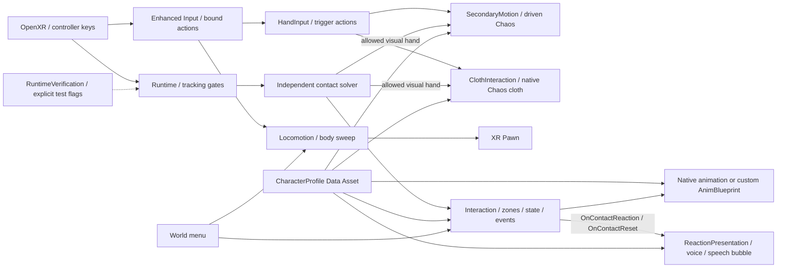

# GratiaVR: архитектура и сопровождение

Правила всех последующих работ находятся в корневом [AGENTS.md](../AGENTS.md).
Эта схема описывает рабочее устройство проекта. Перенос native Chaos Cloth
5 октября 2026 реализован; editor QA PASS, результаты пакета — в STATUS.md.

Мягкая поверхность тела и связанной одежды получает отдельный путь:
`GratiaClothPortLibrary` переносит три включённые исходные клетки Blender и маски
SurfaceDeform в mesh-owned Chaos Clothing Asset. `GratiaClothInteraction` работает
с его частицами и коллизиями рук; `GratiaClothVerification` проверяет частицы и
деформацию видимых вершин только при `-GratiaClothQA`. Тело группы 3 отключается
в rigid-body симуляции, чтобы одна поверхность не симулировалась дважды.

Дополнение: SecondaryMotion принимает разрешённые отсчёты обеих видимых рук и
на следующем PrePhysics применяет ограниченное давление через sweep геометрии
активных Chaos bodies. Это физический путь, независимый от ContactReaction.
Настройки/ограничения/проверки: [HAND_PHYSICS.md](HAND_PHYSICS.md).
HandInput отдельно читает Enhanced Input actions триггеров. SecondaryMotion
захватывает ближайшее разрешённое тело ограниченной пружиной; Runtime передаёт
разрешение только после tracking/recovery/solver gates и при закрытом меню.
Результаты конкретных сборок записываются отдельно; наличие компонента не подтверждает VR-приёмку.

## Где менять поведение

- `GratiaLocomotion`: привязанный InputComponent, движение относительно взгляда,
  sweep корпуса и поворот вокруг камеры. Скорость, dead zone и размеры корпуса доступны в Details.
- `GratiaStage1Runtime`: калибровка, устойчивость трекинга, восстановление и визуальные руки.
  `TargetCharacter` и `SceneContactActor` задаются в карте или через API; случайный первый персонаж не выбирается.
- `GratiaInteraction`: hover/touch/hold/cooldown, владелец руки, выбор реакции,
  событие `OnContactReaction`. Контактные зоны и collision proxies задаются раздельно.
- `GratiaReactionPresentation`: явно принадлежит хосту персонажа и подписан на события
  взаимодействия. Выбирает строку профиля `ReactionLines` (сильное касание, затем зона или канал,
  затем настроение; без повтора подряд), показывает её текст в облачке (`GratiaBubbleWidget` в
  `UWidgetComponent` у головы, справа от игрока, лицом к нему) и играет её голос из места касания;
  контакты не создают компоненты текста или звуковые ресурсы. `OnContactReset` прячет облачко и
  останавливает звук при сбросе/смене профиля; подписки удаляются в EndPlay.
  Звук реакции пространственный (`ReactionAttenuation`: затухание и направление от зоны касания).
- `GratiaPerformanceStage`: сцена текущего перформанса из профиля (`FGratiaPerformanceScene`):
  музыка по часам перформанса (через все части, пересинхронизация после перемотки/повтора),
  статичный партнёр (`UPoseableMeshComponent`, направления костей из данных) и его точка
  обзора. Режим «глаза партнёра» включает `AGratiaStage1Runtime::SetPartnerView` (меню View).
- `GratiaContactSolver`: sweep/depenetration для сфер, капсул и AABB; не знает модели или карты.
- `GratiaPreviewCharacter`: хост выбранного профиля, клипы/мигание и Blueprint getters.
  Имя класса сохранено для совместимости существующей карты; он принимает разные скелеты.
- `GratiaAnimInstance`: маленький native proxy для проверенных клипов, взгляда и пружин;
  в нём же цепочки KawaiiPhysics: мягкие части (`SoftBody.Chains`) и пружинные цепочки волос,
  украшений, ушей и хвоста (`SpringChains`, группы меню Hair/Cloth/Ears).
- `GratiaSecondaryMotion`: ограниченная симуляция групп Chaos, бюджеты, физические приводы и
  аварийный сброс. У Gratia все такие кости — пружинные цепочки, тела Chaos не активны;
  путь остаётся для профилей без них.
- `GratiaSoftBodyInteraction`: руки против цепочек KawaiiPhysics — сферы ладони и пальцев,
  нажим, сжатие (нажатие или «шар в руке»), захват мягкой части или пряди, вибрация.
- `GratiaHandInput`: отдельные bound actions двух триггеров, готовность контекста,
  значения для захвата и диагностика. Захват аксессуаров принадлежит SecondaryMotion,
  мягкой поверхности — ClothInteraction.
- `GratiaClothInteraction`: отдельный PrePhysics-путь двух рук к native cloth,
  ограниченный хват динамической частицы, сброс, диагностика и контроль отклонения.
  Обновление завершённой симуляции предшествует следующему mesh/cloth tick.
- `GratiaSourceClothingAsset`: подкласс Chaos clothing asset; хранит editor-only
  привязку render-секций к source-клеткам и восстанавливает её при штатной
  перепривязке Unreal во время пересборки меша/cook. В игре — обычный cloth asset.
- `GratiaClothVerification`: отдельная opt-in QA мягкой поверхности; synthetic
  нажим/хват, наблюдение частиц и видимых вершин, отпускание и tracking recovery.
- `GratiaMenu`: меню в пространстве; в лобби оно открыто, в сцене по Y/B. Луч из правой
  руки (`UWidgetInteractionComponent`) и триггер, контекст `IMC_GratiaMenu` добавляется сам
  (так OpenXR активирует его action set). Внешний вид — `GratiaMenuWidget` (UMG, собран в C++,
  стиль — скруглённые плашки Slate в коде; из библиотеки сцен только шрифт и кадры сцен). Положение
  считает `UGratiaMenu::ComputePanelTransform` (ниже глаз, не ниже пола и мебели под панелью, лицом к
  глазам); при повороте головы больше `FollowAngleDegrees` панель догоняет взгляд.
- Пауза без фокуса: core ticker в `AGratiaStage1Runtime` следит за `FApp::HasVRFocus` (OpenXR) и ставит
  игру на паузу, пока фокуса нет.
- `GratiaSceneDirector`: поток лобби → загрузка → сцена → лобби. Окружения подгружаются как
  streaming-уровни с маркерами и тегами (см. [EXPERIENCE.md](EXPERIENCE.md)), вместе с ними —
  неизменённые уровни паков Fab (`FGratiaSceneEntry::Backdrops`). Директор ведёт
  реактивный свет, движущиеся объекты, `MPC_Music`, реверберацию комнаты, перезахват SkyLight
  и плейлист. `GratiaSceneLibrary` содержит данные: сцены, анализ музыки, плейлист и
  оформление.
- `GratiaMusicPlayer`: две деки с переходом по биту (кроссфейд, свип НЧ/ВЧ, автопереход) и
  левый/правый каналы из колонок окружения. `GratiaLoadingSpace` и `GratiaLoadingWidget` —
  пространство лобби и загрузки и карточка сцены.
- `GratiaSceneFlowVerification`: opt-in QA потока сцен (`-GratiaFlowQA`).
- `GratiaRuntimeVerification`: отдельное состояние smoke/self-test, synthetic-input test,
  soak и метрики. Оно выполняется только при соответствующих аргументах запуска.
  В soak только тест владеет контактными отсчётами: обычные припаркованные desktop-руки
  не обновляют их и не продлевают correction recovery синтетического контакта.
- `GratiaVREditorTools`: генерация PhysicsAsset и перенос source cloth только
  в редакторе; модуль отсутствует в игре. `GratiaExperienceToolsLibrary` создаёт font
  face без Slate и составной шрифт для `setup_scene_experience.py`, дожидается шейдеров перед
  SceneCapture и уменьшает LOD0 мешей паков для `setup_fab_environments.py` (в коммандлете нет
  подсистемы редактора мешей, на которую опираются Python-обёртки).

## Модель и ручная работа

`/Game/Characters/Profiles/DA_Gratia` хранит mesh, PhysicsAsset, базовые клипы и таблицу реакций по зонам,
semantic bone/morph maps, возможности, зоны/прокси, таймеры, настройки взгляда,
бюджеты, приводы и пружины. У другого профиля отсутствующие возможности отключаются явно.
Runtime не меняет общий Data Asset. Подробный порядок замены — [CHARACTER_PROFILE.md](CHARACTER_PROFILE.md).

Для ответа профиль содержит `ReactionLines` (текст облачка, голос, настроение, зоны или каналы, сила
касания); без голоса у строки звучат `ReactionSounds` (имя зоны → ресурс, затем ключ `Default`) и
`DefaultReactionSound`. Профиль без строк не показывает облачко, а без звуков presenter использует
короткий процедурный сигнал. Назначенные звуки должны быть конечными и не зацикленными.
Выключатель `Interaction.bSound`, capability профиля и cooldown сохраняются; параметры
подписи берутся из `ContactSettings`. Presenter можно отключить для своего слушателя
`OnContactReaction` без изменения определения касаний.

Клипы, mesh и PhysicsAsset редактируются стандартными редакторами Unreal.
Профиль обновляет mesh хоста при назначении в Details. Для собственного Animation Blueprint
предусмотрены `AnimationClass` и `GetCharacterAnimationSnapshot` в Event Blueprint Update Animation.
Текущая анимация Gratia остаётся native SingleNode proxy: её полноценный перевод на редактируемый
AnimGraph с отдельными skeletal-control узлами — дополнительная работа, а не выполненная миграция.

Подготовка модели/экспорт в Blender выполняются через Blender MCP.
PowerShell/Python автоматизируют разработку, импорт, сборку и проверки; готовая игра от них не зависит.

Cloth переносит исходную топологию, bone weights, Pin и область влияния, но солвер
Chaos отличается от Blender. Активные cloth-вершины подавляют обычное позиционное
морф-смещение; лицо и остальные исключённые вершины сохраняют skinning/морфы.
Пересекающиеся SurfaceDeform-маски используют ближайшую допустимую клетку вместо
последовательной композиции Blender. Исходные hair SurfaceDeform выключены в render
и не активируются переносом. Детали и пределы QA: [HAND_PHYSICS.md](HAND_PHYSICS.md).

## Git и сборки

Git хранит исходники/настройки/документы. Git LFS хранит Unreal assets, Blender и изображения.
Первый коммит сохраняет предыдущее состояние. Remote/push не настроены этой работой.
Для клона нужны Git LFS и `git lfs pull`; движок задаётся параметром `-EngineRoot`.

`GratiaVR/Scripts/Build-Stage1.ps1` создаёт build stamp перед компиляцией и manifest
`Builds/Windows/build_manifest.json`: commit/dirty state, engine, UTC,
SHA-256 исходников/настроек/скриптов/ассетов и итогового exe. После упаковки
проверяется, что входные файлы не изменились и каждый файл пакета совпадает
со staged-файлом по SHA-256; список записан в `package_files`. Build id виден в логе и F1.
Прямой Build.bat подходит для разработки; versioned package выпускается через Build-Stage1.

## Проверки

1. `Gratia.Math.ContactSolver`, `Gratia.Math.HandPressure`, `Gratia.Stage1.TrackingLossGate` и
   `Gratia.Stage1.HandOffsetSmoothing`: независимые automation tests (фильтр
   `Automation RunTests Gratia`, ожидаются четыре теста).
2. `Test-Stage1.ps1`: три запуска готовой сборки; lifecycle, профиль, planted limits,
   физические бюджеты, геометрия и keyboard key → mapping → bound action → Pawn delta.
   Также проверяются размеры коллайдеров, передача вращения четырёх физических групп
   видимым костям, Z/X → grab actions → разные тела, отпускание и tracking reset.
3. `Test-CharacterProfiles.ps1`: настоящие Gratia/Manny на разных скелетах, с явными skips недоступных возможностей.
4. `Test-CharacterPoses.ps1` / `Test-CharacterViews.ps1` / `Test-CharacterReactions.ps1`:
   клипы, cooked/evaluated morph curves и снимки готовой игры.
5. `-GratiaSoakSeconds=900`: длительный synthetic mixed soak; учитывает реальные срабатывания
   внутри синтетического сценария, не выдаёт номер целевой зоны за доказательство её покрытия.
   Измеряет время от события контакта до реакции (p95 ≤ 100 мс) и от отпускания до нейтрали (≤ 3 с).
   С `-GratiaScene=<Id>` идёт в настоящем окружении (сцена открывается без лобби).
6. `-GratiaPerfSeconds=<с>`: метрики кадра в `Saved/GratiaMetrics.csv`, затем выход. Для оценки VR-нагрузки
   без шлема: `-emulatestereo -RenderOffScreen -ForceRes -ResX=5144 -ResY=2572` (2 × 2572² — Quest 2).
   `-GratiaShotSeconds=<с>` — снимок, `-GratiaProfileGPUSeconds=<с>` — дерево GPU-проходов `ProfileGPU` в журнал.
7. Реальный VR: левый стик, tracking/contact/menu и SteamVR frame delivery проверяются устройствами.

F1 показывает raw/mapped stick, Pawn delta и причину блокировки. `MOVEMENT` в логе
различает missing player/action/context, zero input, menu blocked, collision blocked и moving.
Контактная диагностика показывает tracking/recovery/correction gate и ближайшую зону.
`source=demo` / `hand=-1` не доказывают реальные касания.

Нужны отдельные аппаратные проверки после любой смены OpenXR bindings или геометрии прокси.
CI можно добавить при выборе хоста с установленным Unreal; локальные проверки уже воспроизводимы.
