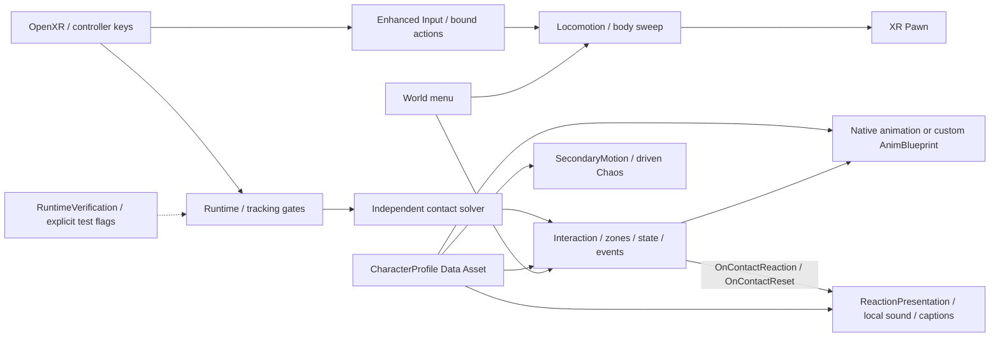

# GratiaVR: архитектура и сопровождение

Правила всех последующих работ находятся в корневом [AGENTS.md](../AGENTS.md).
Эта схема описывает рабочее устройство проекта после миграции v0.6.
Результаты конкретных сборок записываются отдельно; наличие компонента не подтверждает VR-приёмку.

## Где менять поведение

- `GratiaLocomotion`: привязанный InputComponent, движение относительно взгляда,
  sweep корпуса и поворот вокруг камеры. Скорость, dead zone и размеры корпуса доступны в Details.
- `GratiaStage1Runtime`: калибровка, устойчивость трекинга, восстановление и визуальные руки.
  `TargetCharacter` и `SceneContactActor` задаются в карте или через API; случайный первый персонаж не выбирается.
- `GratiaInteraction`: hover/touch/hold/cooldown, владелец руки, выбор реакции,
  событие `OnContactReaction`. Контактные зоны и collision proxies задаются раздельно.
- `GratiaReactionPresentation`: явно принадлежит хосту персонажа и подписан на события
  взаимодействия. Показывает временную подпись и воспроизводит звук; контакты не создают
  компоненты текста или звуковые ресурсы. `OnContactReset` очищает подпись и останавливает
  звук при сбросе/смене профиля; подписки удаляются в EndPlay.
- `GratiaContactSolver`: sweep/depenetration для сфер, капсул и AABB; не знает модели или карты.
- `GratiaPreviewCharacter`: хост выбранного профиля, клипы/мигание и Blueprint getters.
  Имя класса сохранено для совместимости существующей карты; он принимает разные скелеты.
- `GratiaAnimInstance`: маленький native proxy для проверенных клипов, взгляда и пружин.
- `GratiaSecondaryMotion`: ограниченная симуляция групп, бюджеты, физические приводы и аварийный сброс.
- `GratiaMenu`: скрытое по умолчанию меню в пространстве; получает цель от Runtime.
- `GratiaRuntimeVerification`: отдельное состояние smoke/self-test, synthetic-input test,
  soak и метрики. Оно выполняется только при соответствующих аргументах запуска.
- `GratiaVREditorTools`: генерация PhysicsAsset только в редакторе; модуль отсутствует в игре.

## Модель и ручная работа

`/Game/Characters/Profiles/DA_Gratia` хранит mesh, PhysicsAsset, базовые клипы и таблицу реакций по зонам,
semantic bone/morph maps, возможности, зоны/прокси, таймеры, настройки взгляда,
бюджеты, приводы и пружины. У другого профиля отсутствующие возможности отключаются явно.
Runtime не меняет общий Data Asset. Подробный порядок замены — [CHARACTER_PROFILE.md](CHARACTER_PROFILE.md).

Для звука профиль содержит необязательные `ReactionSounds` (имя зоны → ресурс, затем
ключ `Default`) и `DefaultReactionSound`. Если ресурс не назначен, presenter использует
короткий процедурный сигнал. Назначенные звуки должны быть конечными и не зацикленными.
Выключатель `Interaction.bSound`, capability профиля и cooldown сохраняются; параметры
подписи берутся из `ContactSettings`. Presenter можно отключить для своего слушателя
`OnContactReaction` без изменения определения касаний.

Клипы, mesh и PhysicsAsset редактируются стандартными редакторами Unreal.
Профиль обновляет mesh хоста при назначении в Details. Для собственного Animation Blueprint
предусмотрены `AnimationClass` и `GetCharacterAnimationSnapshot` в Event Blueprint Update Animation.
Текущая анимация Gratia остаётся native SingleNode proxy: её полноценный перевод на редактируемый
AnimGraph с отдельными skeletal-control узлами — дополнительная работа, а не выполненная миграция.

Подготовка модели/экспорт в Blender выполняются через Blender MCP.
PowerShell/Python автоматизируют разработку, импорт, сборку и проверки; готовая игра от них не зависит.

## Git и сборки

Git хранит исходники/настройки/документы. Git LFS хранит Unreal assets, Blender и изображения.
Первый коммит сохраняет предыдущее состояние. Remote/push не настроены этой работой.
Для клона нужны Git LFS и `git lfs pull`; движок задаётся параметром `-EngineRoot`.

`GratiaVR/Scripts/Build-Stage1.ps1` создаёт build stamp перед компиляцией и manifest
`Builds/Stage1/Windows/build_manifest.json`: commit/dirty state, engine, UTC,
SHA-256 исходников/настроек/скриптов/ассетов и итогового exe. После упаковки
проверяется, что входные файлы не изменились. Build id виден в логе и F1.
Прямой Build.bat подходит для разработки; versioned package выпускается через Build-Stage1.

## Проверки

1. `Gratia.Math.ContactSolver` и `Gratia.Stage1.TrackingLossGate`: независимые automation tests.
2. `Test-Stage1.ps1`: три запуска готовой сборки; lifecycle, профиль, planted limits,
   физические бюджеты, геометрия и keyboard key → mapping → bound action → Pawn delta.
3. `Test-CharacterProfiles.ps1`: настоящие Gratia/Manny на разных скелетах, с явными skips недоступных возможностей.
4. `Test-CharacterPoses.ps1` / `Test-CharacterViews.ps1` / `Test-CharacterReactions.ps1`:
   клипы, cooked/evaluated morph curves и снимки готовой игры.
5. `-GratiaSoakSeconds=900`: длительный synthetic mixed soak; учитывает реальные срабатывания
   внутри синтетического сценария, не выдаёт номер целевой зоны за доказательство её покрытия.
6. Реальный VR: левый стик, tracking/contact/menu и SteamVR frame delivery проверяются устройствами.

F1 показывает raw/mapped stick, Pawn delta и причину блокировки. `MOVEMENT` в логе
различает missing player/action/context, zero input, menu blocked, collision blocked и moving.
Контактная диагностика показывает tracking/recovery/correction gate и ближайшую зону.
`source=demo` / `hand=-1` не доказывают реальные касания.

Нужны отдельные аппаратные проверки после любой смены OpenXR bindings или геометрии прокси.
CI можно добавить при выборе хоста с установленным Unreal; локальные проверки уже воспроизводимы.
